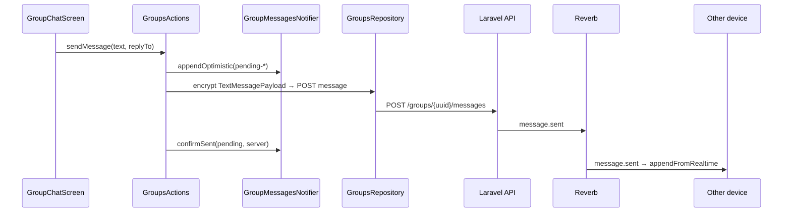
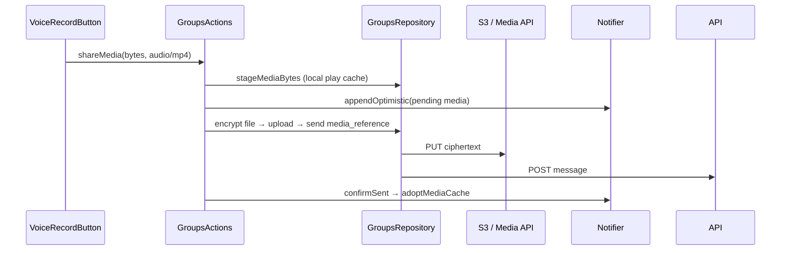

# Groups & Chat — Client Flow (Flutter)

End-to-end behavior of the mobile chat client. Complements the REST contract in [api-contract.md](./api-contract.md).

**Prerequisites:** user is connected to other members ([03-connections](../03-connections-and-privacy/api-contract.md)), identity keys exist ([12-encryption](../12-encryption-and-keys/api-contract.md)).

---

## Architecture overview

```
GroupChatScreen
    → GroupsActions (send / edit / delete / shareMedia)
        → GroupsRepository (encrypt, API, cache)
            → GroupsApi → Laravel /api/v1/groups/*
    → GroupMessagesNotifier (optimistic UI, realtime merge)
    → ChatInboxNotifier (unread badges)
    → GroupsRealtimeService (Reverb WebSocket)
    → PushNotificationService (FCM when backgrounded)
```

**Rule:** screens never call Dio directly — all network access goes through `GroupsRepository` / `GroupsApi`.

Key paths:

| Concern | Path |
|---------|------|
| Chat UI | `mobile/lib/features/groups/presentation/group_chat_screen.dart` |
| Bubbles, reply, voice | `mobile/lib/features/groups/presentation/widgets/group_widgets.dart` |
| Repository + actions | `mobile/lib/features/groups/data/groups_repository.dart` |
| Message state | `mobile/lib/features/groups/providers/group_messages_notifier.dart` |
| Realtime | `mobile/lib/features/groups/providers/groups_realtime_provider.dart` |
| Crypto | `mobile/lib/features/groups/services/group_crypto_service.dart` |
| Reply payload | `mobile/lib/features/groups/models/text_message_payload.dart` |

---

## End-to-end encryption

### Group key bootstrap

1. On first chat for a group, the **owner/admin** uploads wrapped group keys (`POST /groups/{uuid}/encryption/envelopes`).
2. Each member fetches their envelope (`GET /groups/{uuid}/encryption/envelopes/me`).
3. Client unwraps with the user's X25519 identity private key → AES-256 group key (cached in memory per session).

### Text messages

1. Build plaintext (plain string, or JSON for replies — see below).
2. Encrypt with AES-GCM using the group key → `ciphertext` + `nonce` (base64 on wire).
3. `POST /groups/{uuid}/messages` with `type: text`.
4. Server stores binary ciphertext only; broadcasts `message.sent` via Reverb.

### Reply metadata (still E2E)

Replies embed metadata **inside** the encrypted plaintext:

```json
{
  "text": "Sounds good!",
  "reply": {
    "message_uuid": "...",
    "sender_display_name": "Ali",
    "preview": "See you at 6?"
  }
}
```

If there is no reply, plaintext is a plain string (backward compatible). Parsed by `TextMessagePayload` in the mobile app.

### Voice / media messages

1. Record or pick file on device.
2. Encrypt file bytes with group key → upload ciphertext to S3 (or API proxy).
3. Encrypt a JSON **caption** as the message body:

```json
{
  "name": "voice-1234567890.m4a",
  "mime": "audio/mp4",
  "file_nonce": "<base64 nonce used for file encryption>"
}
```

4. `POST /groups/{uuid}/messages` with `type: media_reference` and `media_file_uuid`.
5. Peers download ciphertext from S3, decrypt with `file_nonce`, play inline.

**Firebase (FCM)** sends notification alerts only — never decrypted message content.

---

## Optimistic send

Text and media use the same pattern for instant UI:

| Step | Behavior |
|------|----------|
| 1 | Create local message with UUID `pending-{microseconds}` |
| 2 | Append to `GroupMessagesNotifier` immediately |
| 3 | Fire API upload/send in background (`unawaited`) |
| 4 | On success: `confirmSent(pendingUuid, serverMessage)` — replaces pending row |
| 5 | On failure: `removePending(pendingUuid)` + error snackbar |

Voice messages additionally **stage local audio bytes** (`GroupsRepository.stageMediaBytes`) so the sender can play instantly before upload completes.

---

## Message actions (WhatsApp-style)

| Action | How | Scope |
|--------|-----|-------|
| **Reply** | Swipe right, or long-press → Reply | All non-deleted messages |
| **Copy** | Long-press → Copy | Text messages only |
| **Edit** | Long-press → Edit | Own text messages |
| **Delete** | Long-press → Delete | Own messages |
| **Message info** | Long-press → Message info | All (read receipts for own messages) |

Reply preview labels for media: `Voice message`, `Photo`, `GIF`, `Video`, or filename.

---

## Voice messages

| Step | Implementation |
|------|----------------|
| Record | `VoiceRecordButton` — AAC via `record` package |
| Send | Optimistic `media_reference` + staged local file |
| Play | `InlineVoiceMessagePlayer` in bubble — play/pause, progress bar |
| Receive | Download + decrypt on first play; cached locally thereafter |

No modal popup — playback is inline in the chat bubble.

---

## Realtime delivery (Reverb)

When the app is **foreground** and authenticated:

1. `GroupsRealtimeService` connects to Reverb using `GET /groups/realtime/config`.
2. Subscribes to `private-group.{uuid}` for every inbox group.
3. Events update inbox and/or open chat (see [09-realtime-websockets](../09-realtime-websockets/README.md)).

| Event | Open chat | Inbox |
|-------|-----------|-------|
| `message.sent` | Append + decrypt (skip own sender) | Unread +1, last message |
| `message.updated` | Decrypt + replace row | Update last message if match |
| `message.deleted` | Mark deleted in list | Mark last message deleted if match |
| `group.read` | Refresh read receipts | Clear unread (self) |
| `group.deleted` | Refresh / remove | Remove group |

---

## Push notifications (FCM)

When the app is **background or killed**:

1. Backend queues `SendMessagePushNotification` after `message.sent`.
2. FCM delivers a notification (title = sender name, no plaintext body).
3. Mobile shows local notification + updates app icon badge.
4. Tap → deep link to `GroupChatScreen`.

Foreground: Reverb handles live updates; FCM may still refresh inbox badge via `chatNotificationsCoordinator`.

See [push-notifications-setup.md](../10-flutter-mobile/push-notifications-setup.md).

---

## Polling fallback

If Reverb is unavailable:

| Provider | Interval | Purpose |
|----------|----------|---------|
| `groupsListPollingProvider` | 10 s | Inbox unread + new conversations |
| `groupChatPollingProvider` | 60 s | Open chat message refresh |

Realtime is preferred; polling keeps UI usable during dev or Reverb outages.

---

## Caching

| Cache | Location | TTL / scope |
|-------|----------|-------------|
| Message list | `GroupsRepository._messagesCache` | Session; updated on send/receive |
| Group AES key | `GroupsRepository._groupKeyCache` | Session |
| Voice/media files | `GroupsRepository._mediaLocalPaths` | Temp files on disk |
| Open chat notifier | `ref.keepAlive()` | 20 min after leaving chat |

Opening a chat shows cached messages instantly; background refresh updates silently.

---

## Sequence: send text with reply



---

## Sequence: voice message



---

## Related docs

- [API contract](./api-contract.md)
- [Realtime WebSockets](../09-realtime-websockets/README.md)
- [Media & S3](../06-media-and-s3/api-contract.md)
- [Push setup](../10-flutter-mobile/push-notifications-setup.md)
- [Production deployment](../11-deployment-and-ops/production-deployment.md)
