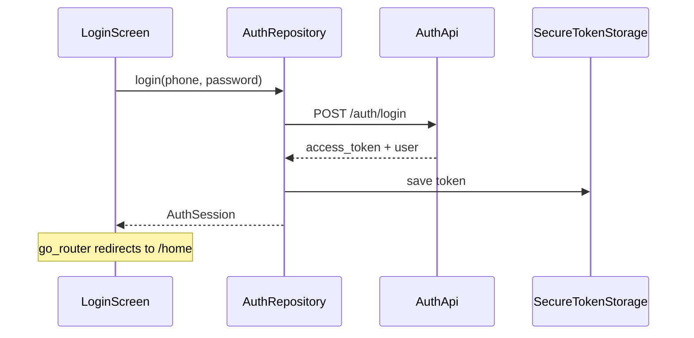

# Flutter Architecture

## Layers

```
presentation (screens, widgets)
        ↓ reads/watches
providers (Riverpod — UI state, async)
        ↓ calls
data/repositories (orchestration, caching)
        ↓ calls
data/*_api.dart (raw HTTP, maps JSON → models)
        ↓ uses
core/network/api_client.dart (Dio + auth header)
```

## Auth session flow



On app start, `AuthRepository.restoreSession()` loads token from secure storage and optionally validates via a protected endpoint.

## Routing

`go_router` with redirect:

- No token → `/login` (or `/register`)
- Token present → `/home` (shell with bottom nav, expanded later)

Auth routes are public; all other routes require session.

## Error handling

`ApiException` wraps Dio errors:

- 422 → validation messages (show in `ErrorBanner` / field errors)
- 401 → clear session, redirect login
- Network → user-friendly offline message

Repositories throw `ApiException`; providers catch and expose `AsyncValue.error`.

## Adding a new feature

1. Add paths to `api_paths.dart`
2. Create `features/{name}/data/{name}_api.dart` + `{name}_repository.dart`
3. Add models under `features/{name}/models/`
4. Add Riverpod providers
5. Build screens using `shared/widgets/`
6. Register routes in `app_router.dart`
7. Update this doc's status table

## Testing strategy

- Unit: validators, model parsing, repository with mocked Dio
- Widget: auth forms with `ProviderScope` overrides
- Integration: against local Laravel (`migrate --seed`)
